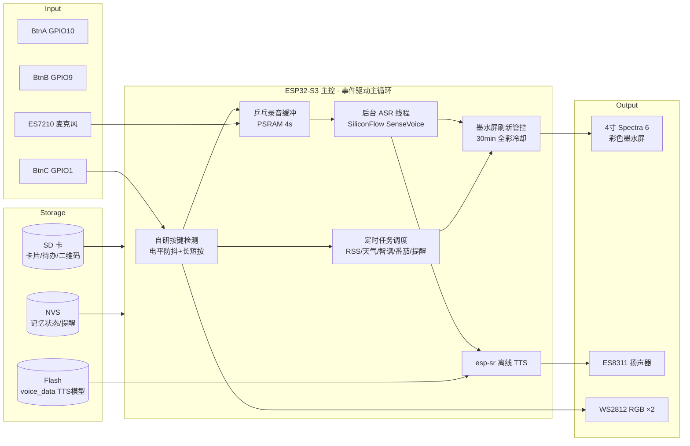

<div align="center">

# 📟 M5Stack PaperColor · eInk Desk Terminal

### 把官方 PaperColor 彩色墨水屏，变成你的桌面学习终端

**A Full-Featured Desk Study Terminal for M5Stack PaperColor**

> 一块 4 寸 **Spectra 6 全彩墨水屏**，低功耗常亮摆上桌——黄历、新闻早报、记忆卡片、番茄钟、语音待办、环境仪表盘，全部离线可用、越用越懂你。

[](https://shop.m5stack.com/products/m5paper-color-esp32s3-dev-kit)
[](https://www.espressif.com/)
[](https://shop.m5stack.com/products/m5paper-color-esp32s3-dev-kit)
[](https://platformio.org/)
[](LICENSE)
[](https://github.com/DrDavidDa/eInk-Desk-Terminal/pulls)

</div>

<div align="center">


**🚀 基于 [M5Stack PaperColor](https://shop.m5stack.com/products/m5paper-color-esp32s3-dev-kit) 深度定制**
[🛒 官方购买](https://shop.m5stack.com/products/m5paper-color-esp32s3-dev-kit) ・ [📖 官方文档](https://docs.m5stack.com/en/core/PaperColor)

</div>

---

## ✨ 它是什么

**这是 M5Stack PaperColor 的「完全体」固件**——把官方 4 寸 Spectra 6 全彩墨水屏开发板，变成一块摆在桌上、低功耗常亮、越用越懂你的「第三屏」：替代手机去看「今天、新闻、要背的知识、该干什么」。

### 硬件基底（M5Stack PaperColor 官方规格）

| 项 | 规格 | 项 | 规格 |
|----|------|----|------|
| 主控 | ESP32-S3R8 双核 240MHz | 屏幕 | 4" E-Ink **Spectra 6 全彩** 400×600 |
| 内存 | 16MB Flash + 8MB PSRAM | 电池 | 1250mAh · 待机仅 **92.53µA** |
| 语音 | ES8311 编解码 + MEMS 麦克风(AEC) + 1W 喇叭 | 传感 | SHT40 温湿度 + RX8130CE RTC |
| 扩展 | microSD + 红外 + 2×RGB + HY2.0 | 尺寸 | 70.8×103.9×8.5mm · 73.3g |

> 🛒 [Get one now!](https://shop.m5stack.com/products/m5paper-color-esp32s3-dev-kit) — 官方商店 ・ 📖 [Docs](https://docs.m5stack.com/en/core/PaperColor) — 官方文档

### 功能速览

- 🗓️ **日历黄历**：农历 / 干支 / 宜忌 + 月历 + 天气
- 📰 **资讯早报**：实时 RSS 过滤科技新闻
- 🧠 **考点闪卡**：Anki 间隔记忆 + 掉电记忆 + 速记口诀
- 🍅 **番茄钟**：墨水屏低频刷新，绝不闪眼打扰
- 🎙️ **语音交互**：全离线中文 TTS + 云端 ASR，「小彩」语音助手
- 💤 **极致省电**：待机页只画一次、绝不刷新，墨水屏寿命最大化

---

## 📺 效果演示（待机页）

```
┌────────────────────────────────────────────┐
│ ● WiFi                       ● 电量 86%      │
│                                             │
│           2026 年                           │
│       8   月   11   日                       │
│         ┌──────────┐                        │
│         │  星期二   │                        │
│         └──────────┘                        │
│      六月廿一 · 宜祈福 · 忌动土              │
│       ☀ 晴   33°/23°                       │
│        ▲ 按任意键唤醒                        │
└────────────────────────────────────────────┘
```

> 纯白极简 · 大字排印 · 无时钟不刷新 · 一年不烧屏。

---

## 🚀 核心亮点

| # | 亮点 | 说明 |
|---|------|------|
| 1 | **全离线中文语音合成** | esp-sr TTS 模型内置于 Flash 分区，朗读新闻 / 待办 / 卡片，不依赖网络 |
| 2 | **全局语音助手「小彩」** | 任意页长按 C → 说指令 → 一次刷屏直达，「打开日历」「提醒我3点开会」「开始番茄」 |
| 3 | **Anki 间隔记忆算法** | 考点卡片按掌握度安排复习，NVS + SD 掉电永久存储 |
| 4 | **精确农历/黄历** | 1900–2100 离线数据表，农历 / 干支 / 每日宜忌 |
| 5 | **墨水屏刷新管控** | 事件驱动白名单 + 30 分钟全彩冷却，绝无无理由刷新 |
| 6 | **真·2mA 待机省电** | 3 分钟自动待机：关 WiFi 无线电 + CPU 轻睡眠 + 待机页不刷新 → 待机仅 ~2mA，续航 25~50 天 |
| 7 | **离线 OCR 友好大字** | 全界面 16/20/24px 大字号排版，一臂距离清晰可读 |
| 8 | **SD 卡双引擎图像** | 原生支持 PNG / JPG / BMP + 中文文件名 |
| 9 | **多 WiFi 自动切换** | 3 组 SSID 配置，待机唤醒自动重连 |
| 10 | **串口诊断协议** | `#STATUS` `#NEWS` `#WX` `#CFG` 等命令 + Python 回归脚本 |

---

## 📄 功能全景（7 页面）

| 页 | 名称 | 核心功能 | A | B | 长按A | 长按B | 长按C |
|----|------|---------|---|---|-------|-------|-------|
| 0 | 日历黄历 | 横幅 + 月历 + 天气卡 + 黄历 | 前一天 | 后一天 | 跳末页 | 报天气 | 刷天气 |
| 1 | 资讯早报 | IT之家 RSS 10 条（自动过滤非科技） | 上条 | 下条 | — | 朗读 | 联网刷 |
| 2 | 考点闪卡 | SD 卡片 问题/答案/速记口诀 | 上条 | 下条 | 标记掌握 | 朗读 | 强刷 |
| 3 | CodingPlan | 智谱额度 3 卡 + Token + 工具用量 | 上页 | — | — | — | 强刷 |
| 4 | 语音待办 | 录音/转写/详情/回放 | 上条 | 下条 | 详情回放 | 删除 | 切页 |
| 5 | 仪表盘 | 环境/设备/番茄/备考倒计时 | 上页 | 番茄开停 | — | — | 强刷 |
| 6 | 二维码 | SD 二维码图片翻页 | 上页 | 下页 | — | — | 关机菜单 |

**全局**：RGB 状态灯 · 待机省电 · 定时语音提醒 · 离线 TTS · 串口诊断 · 多 WiFi · 墨水屏刷新管控

---

## 🎙️ 语音交互

### 两种方式

| 方式 | 触发 | 场景 |
|------|------|------|
| **全局语音命令** | 任意页**长按 C**（1.3s）→ 蓝灯录音 → 3.5s 自动停 → 橙灯转写 → 一次刷屏 | 快速切页 / 天气 / 番茄 / 提醒 |
| **待办录音** | 待办页录音，「小彩」前缀才走命令 | 语音记待办，100% 不误删 |

### 命令示例

```
「提醒我3点开会」     → 到点语音播报 + 屏幕提示
「今天天气」         → 切日历页 + 刷天气 + 播报
「读新闻」           → 切早报页 + 朗读头条
「开始番茄」         → 启动 25 分钟专注
「打开日历 / 待办 / 考点 / 仪表盘 / 二维码」 → 直达页面
「日历」             → 整句精确匹配，直呼页名
```

> 📖 完整速查：[docs/voice-commands.md](docs/voice-commands.md)

---

## 🏗️ 架构



---

## 🛠️ 快速开始

### 硬件清单

| 组件 | 说明 |
|------|------|
| [🛒 M5Stack **PaperColor**](https://shop.m5stack.com/products/m5paper-color-esp32s3-dev-kit) | ESP32-S3R8 + 4" Spectra 6 彩色墨水屏（[官方文档](https://docs.m5stack.com/en/core/PaperColor)） |
| microSD 卡 | 存考点卡片、语音待办、二维码图 |
| USB-C 数据线 | 烧录 + 串口（建议优质线材） |

### 1. 环境

```bash
# PlatformIO Core
pip install platformio
pio pkg install --platform espressif32
```

### 2. 接线（一般无需额外接线）

USB-C 直连即可。PaperColor 板载按键、麦克风、扬声器、SD、温湿度、RGB 灯全部集成。

### 3. 配置

编辑 `src/main.cpp` 顶部的集中配置区：

```cpp
#define WIFI_SSID     "你的WiFi"
#define WIFI_PASS     "你的密码"
```

或使用配套工具 `write_config.py`（插上 USB 自动跟随电脑 WiFi）：

```bash
python write_config.py
```

> 需要配置 智谱 CodingPlan token（`zhipu_token.txt`）与 ASR key（`sf_api_key.txt`）。

### 4. 烧录

```bash
pio run -j 1 -t upload --upload-port COM4
```

> ⚠️ 必须 `-j 1`（防 OOM）；多设备务必先核对 MAC：`pio device list --json-output`。

### 5. 使用

- 短按 A/B 翻页，长按 A/B 触发功能
- **长按 C = 全局语音命令**
- 3 分钟无操作自动进待机页，任意键唤醒

---

## 📁 项目结构

```
PaperColor_Study/
├── src/
│   └── main.cpp              # 全部固件逻辑（约 4400 行，事件驱动）
├── include/
│   └── lunar_cal.h           # 1900–2100 农历/干支/黄历离线表
├── lib/
│   └── esptts/               # esp-sr 中文 TTS 预编译库 + voice_data 模型
├── cards/
│   └── ch0X.json             # 考点卡片（Anki 导出格式：分类/问题/答案/口诀）
├── docs/
│   ├── hardware.md           # 硬件规格 / 引脚映射
│   ├── voice-commands.md     # 语音命令速查
│   └── troubleshooting.md    # 实测踩坑记录
├── platformio.ini            # 编译配置（16MB Flash + voice_data 分区）
├── tts_16MB.csv              # 分区表（含 3MB TTS 模型分区，必须）
└── README.md
```

### 根目录配套 Python 工具

| 脚本 | 用途 |
|------|------|
| `write_config.py` / `write_hotspot.py` | 配置 WiFi / 智谱 token |
| `parse_cards.py` | Anki Markdown → `/cards/*.json` |
| `crop_qr.py` | 二维码图片裁边 |
| `upload_file.py` | 上传文件到 SD 卡 |
| `send_cmd.py` / `read_serial.py` | 串口命令 / 监听 |
| `verify_audit.py` / `verify_all.py` | 回归测试（#STATUS/#NEWS/#WX...） |

---

## 🔧 技术要点

- **ED2208 刷新 4 模式**：`epd_fast`(黑白) / `epd_text`(彩色快) / `epd_quality`(彩色全彩)
- **全彩 30 分钟冷却**：频繁刷新自动降级黑白快刷
- **待机不刷新**：无时钟，只画一次 → 省电 + 防烧屏
- **真·轻睡眠待机**：`WiFi.mode(WIFI_OFF)` 关无线电 + `esp_light_sleep_start()` 停 CPU，待机功耗 ~80mA → **~2mA**，按键瞬时唤醒
- **录音/放音互斥**：GPIO45 共用，录音前 `Speaker.end()`
- **ASR 走 HTTP(80)**：TLS 握手在 ESP32 上会卡，明文更快更稳
- **Font8 大数字**：75px 实心 RLE 字体在彩色抖动下稳定显示（Font7 会缺笔画）

> 完整踩坑记录：[docs/troubleshooting.md](docs/troubleshooting.md)

---

## 🧩 路线图

- [x] 7 页面完整功能
- [x] 全局语音助手「小彩」
- [x] 待机页纯白极简 v9
- [x] 待机唤醒 WiFi 自动重连
- [ ] 本地唤醒词（喊话唤醒，省电 vs 体验权衡中）
- [ ] 天气多城市配置
- [ ] Web 端卡片管理

---

## 📄 License

[MIT](LICENSE) © [DrDavidDa](https://github.com/DrDavidDa)

---

## ⭐ 喜欢这个项目？

如果你觉得它有点意思：

- 点个 **Star** ⭐ 让更多人看到
- 提 [Issue](https://github.com/DrDavidDa/eInk-Desk-Terminal/issues) 分享你的想法
- 提 [PR](https://github.com/DrDavidDa/eInk-Desk-Terminal/pulls) 一起完善

**墨水屏不该只用来「放那吃灰」——让它替你干活。** 📟
