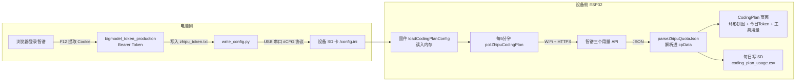

# 🧠 ESP32 挂载 & 显示「Coding Plan」—— 全面深度小白教程

> **本教程目标**：让任何 AI 编程助手 / 开发者，从零学会「如何让一台 ESP32 设备（本项目的 M5Stack PaperColor）通过网络抓取智谱 Coding Plan 用量数据，并在墨水屏上显示出来」。
> **真实项目**：`PaperColor_Study`（固件 `src/main.cpp`，约 4400 行）
> **难度**：零基础 → 实战，全程用大白话 + 真实代码。
> **版本**：2026-08-13，基于 v3.0 固件。

---

## 📖 目录

1. [先搞懂：Coding Plan 是什么？](#1-先搞懂coding-plan-是什么)
2. [整体架构：数据从哪来到哪去](#2-整体架构数据从哪来到哪去)
3. [第一个核心：三个用量接口](#3-第一个核心三个用量接口)
4. [第二个核心：Token 怎么拿](#4-第二个核心token-怎么拿)
5. [第三个核心：配置怎么下发到设备](#5-第三个核心配置怎么下发到设备)
6. [第四个核心：固件怎么拉数据](#6-第四个核心固件怎么拉数据)
7. [第五个核心：怎么在屏幕上显示](#7-第五个核心怎么在屏幕上显示)
8. [踩坑大全（血的教训）](#8-踩坑大全血的教训)
9. [验证与调试](#9-验证与调试)
10. [复刻指南：换一台设备怎么做](#10-复刻指南换一台设备怎么做)
11. [附：关键代码索引](#11-附关键代码索引)

---

## 1. 先搞懂：Coding Plan 是什么？

### 1.1 一句话

**智谱 AI 的 Coding Plan（编程套餐）** = 你给 AI 编程助手（比如清言/CodeGeeX 等用智谱大模型的编程产品）买的一个"用量套餐"。它有额度，用多了会超限。

**额度维度（3 个）**：
| 维度 | 含义 | 例子 |
|------|------|------|
| 每 5 小时 | 5 小时内最多能用多少 | 5h=15% → 5 小时内用了 15% |
| 每周 | 本周额度 | 7d=24% → 本周用了 24% |
| MCP 月度 | 每月工具(MCP)调用额度 | mcp=20% → 本月工具用了 20% |

### 1.2 为什么要放在 ESP32 上显示？

因为**编程时人容易超限**（AI 一直干活，额度悄悄烧完）。把实时用量放在桌面墨水屏上，随时一抬眼就知道"还剩多少"、**快超了赶紧停**，不用切浏览器。

### 1.3 智谱官方网页

- 用量统计页：`https://chatglm.cn/coding-plan/personal/usage`（人眼看的）
- 但我们设备不打开网页，我们**直接调它的后端 API**（见下一节）。

---

## 2. 整体架构：数据从哪来到哪去

整个系统分「**电脑侧**」和「**设备侧**」两半：



**一句话链路**：浏览器拿 Token → 电脑写配置 → 串口塞进设备 SD → 设备 WiFi 轮询智谱 API → 解析存内存 → 屏幕显示。

**⚠️ 最重要的设计原则（贯穿全项目）**：
> **「数据获取」和「屏幕刷新」彻底解耦**。
> - 轮询只往**内存变量**（`cpData` 结构体）里写数据，**绝不直接刷屏**；
> - 只有用户按键、或整点刷新等少数时机，才用内存数据画一次屏。
>
> 因为墨水屏刷新一次要 2-16 秒（全彩更慢），如果边拉数据边刷屏，设备会卡死、页面闪烁、电也耗光。

---

## 3. 第一个核心：三个用量接口

### 3.1 认证方式（最关键！）

```text
Authorization: Bearer <bigmodel_token_production>
```

**不是 Cookie，是 Bearer Token**。这个 token 是智谱浏览器里的 `bigmodel_token_production` 这个 Cookie 的值（下一节讲怎么拿）。

### 3.2 接口 ① 额度总览（3 个百分比）

```http
GET https://open.bigmodel.cn/api/monitor/usage/quota/limit
Authorization: Bearer <token>
```

**真实返回**（代码注释里就有）：
```json
{
  "code": 200,
  "data": {
    "limits": [
      {"type": "TOKENS_LIMIT", "unit": 3, "number": 5, "percentage": 100, "nextResetTime": 1786249956626},
      {"type": "TOKENS_LIMIT", "unit": 6, "number": 1, "percentage": 21,  "nextResetTime": 1786230000000},
      {"type": "TIME_LIMIT",   "unit": 5, "number": 1, "percentage": 20,  "nextResetTime": 1786316400000}
    ],
    "level": "pro"
  },
  "success": true
}
```

解析要点：
- `data.limits` 是数组，**固定顺序**：`[0]`=每5小时、`[1]`=每周、`[2]`=MCP月度
- 每项 `percentage` = 已用百分比，`nextResetTime` = 重置时间（**毫秒 UTC 时间戳**）

### 3.3 接口 ② 今日 Token 消耗

```http
GET https://open.bigmodel.cn/api/monitor/usage/model-usage?startTime=2026-08-13+00:00:00&endTime=2026-08-13+23:59:59
Authorization: Bearer <token>
```

取 `data.totalUsage.totalTokensUsage`（今日总 token）+ `data.totalUsage.modelSummaryList[0].totalTokens`（主模型 token）。

### 3.4 接口 ③ 工具用量（更直观的工作量）

```http
GET https://open.bigmodel.cn/api/monitor/usage/tool-usage?startTime=2026-08-13+00:00:00&endTime=2026-08-13+23:59:59
Authorization: Bearer <token>
```

取 `data.totalUsage.totalNetworkSearchCount`（联网搜索 MCP 次数）+ `data.totalUsage.totalWebReadMcpCount`（网页读取 MCP 次数）。

> **为什么加③**：模型 token 是"内部数字"，普通用户无感；而"联网搜索了多少次、读了几个网页"更直白，一眼看出 AI 干没干活。

---

## 4. 第二个核心：Token 怎么拿

### 4.1 手动提取（一次搞定，长期有效）

1. 浏览器登录 `https://chatglm.cn/`（智谱，且买过 Coding Plan）
2. 按 `F12` 打开开发者工具 → 切到 **Application/应用** 标签 → 左侧 **Cookies** → 找到域名 `chatglm.cn`
3. 找到名为 **`bigmodel_token_production`** 的 Cookie，复制它的**值**（一个很长的 JWT 字符串，约 428 字符）
4. 存到项目根目录 `zhipu_token.txt`（已被 .gitignore 排除，**别提交到 GitHub**）

> ⚠️ Token 本质是"你的登录凭证"，泄露 = 别人能用你的额度。**存本地、别上传**。

### 4.2 为什么放本机 txt 而不直接烧进固件？

- Token 会过期/换号，放固件里每次改都要重编译重烧录（2 分钟+）；
- 放 `zhipu_token.txt` + 脚本下发，**换 Token 只重跑一次脚本**（10 秒）。
- 这叫「**配置与代码分离**」——固件只认 SD 卡上的 `config.ini`，跟 Token 具体是啥无关。

---

## 5. 第三个核心：配置怎么下发到设备

### 5.1 config.ini 长啥样

设备 SD 卡上的 `/config.ini` 是**一切配置的源头**，长这样：

```ini
use_wifi=true
wifi_ssid=我的手机热点
wifi_pass=12345678
wifi_ssid2=家里WiFi
wifi_pass2=xxxxxxxx
poll_interval_sec=300
sf_api_key=sk-xxxx
zhipu_cookie=eyJhbGciOiJIUzI1NiIsInR5cCI6IkpXVCJ9...（约428字符的token）
```

- `use_wifi=true` → 启用「设备 WiFi 直连智谱」方案
- 最多 **3 组 WiFi**（ssid/pass/ssid2/pass2/ssid3/pass3），自动挨个试
- `zhipu_cookie` = 就是第 4 节那个 Bearer Token

### 5.2 下发脚本 write_config.py 做了啥

`write_config.py` 自动完成：
1. `netsh` 命令检测**当前电脑连的 WiFi** 名 + 密码
2. 读 `zhipu_token.txt`、`wifi_extra.txt`（可选第 2/3 组 WiFi）
3. 拼出完整 config.ini 内容
4. 打开串口 COM4，**用特殊协议分条发给设备**（下一节）

### 5.3 串口协议（重点中的重点）

**背景**：设备串口是 **USB CDC**（ESP32-S3 内置 USB），它有**三个致命限制**，逼出了这套协议：

| 限制 | 后果 |
|------|------|
| ① 一次接收约 493 字节会**溢出丢数据** | 整段 config.ini（~574B）一次发必丢 |
| ② 协议用 `\n` 当命令结束符 | config.ini 是多行文本，含一堆 `\n`，直接发会被拆散 |
| ③ 缓冲 512 不够装 token（~428B）+ 别的字段 | token 会被截断 |

**解决方案 = 四条命令 + ACK 流控**（主机发一条、等设备回 `[OK]` 再发下一条）：

```
① #CFGCLEAR           → 设备清空 config.ini          → 回 [OK] cfg cleared
② #CFGLINE|use_wifi=true   （一行一条，<100字节）      → 回 [OK] line
   #CFGLINE|wifi_ssid=...
   ... 逐行把除 token 外的配置写完 ...
③ #CFGTOK|<token第1块80字符>  → 设备累积进内存缓冲    → 回 [OK] tok
   #CFGTOK|<token第2块>       → 回 [OK] tok
   ... 分块直到 token 发完（每块 80 字符，防止 USB 溢出）...
④ #CFGDONE            → 设备把累积的 token 拼成 zhipu_cookie= 行写进 SD → 回 [OK] config saved (token_len=334)
```

设备侧固件收到 `#CFGDONE` 后：`SD.open("/config.ini", FILE_APPEND)` → 追加 `zhipu_cookie=` + 累积的 `cpTokenBuf` → `loadCodingPlanConfig()` 重新加载 → 打印 token 长度确认。

> **一句话**：因为 USB 口"小气"，所以大文件要**拆成小条、一条一条确认**地喂进去。

### 5.4 换 WiFi / 换 Token 的标准动作

```bash
py -3 write_config.py    # 自动检测当前 WiFi，重新下发
```
（换公司/换环境：把新 WiFi 加进 `wifi_extra.txt` 再跑一次）

---

## 6. 第四个核心：固件怎么拉数据

### 6.1 数据落脚点：cpData 结构体

所有抓回来的数据先存内存结构体 `CodingPlanData cpData`（`src/main.cpp` 约 500 行）：

```cpp
struct CodingPlanData {
    int   quota_5h_percent = 0;       // 5小时额度 %
    int   quota_7d_percent = 0;       // 每周额度 %
    int   quota_mcp_percent = 0;      // MCP月度额度 %
    char  quota_5h_reset_time[12];    // 重置时间 "HH:MM"
    char  quota_7d_reset_time[12];    // 重置时间 "MM-DD HH:MM"
    char  quota_mcp_reset_time[12];
    long  daily_token_total = 0;      // 今日 Token 总量
    long  daily_token_main = 0;       // 今日主模型 Token
    long  tool_search_count = 0;      // 联网搜索次数
    long  tool_webread_count = 0;     // 网页读取次数
    char  plan_status[16];            // idle/planning/coding...
    char  update_time[32];            // 上次更新 "MM-DD HH:MM"
    bool  connected = false;          // 是否连上
};
```

**全项目铁律**：网络任务**只写 cpData**，画面要显示时再读它 → 完美解耦。

### 6.2 主函数 pollZhipuCodingPlan()（核心中的核心）

位置 `src/main.cpp` ~3157 行。流程：

```
pollZhipuCodingPlan()
├─ 0. 前置检查：没开use_wifi？没token？正在轮询？→ 直接return（防重入）
├─ 1. 没连网？→ WiFi.mode(STA)，依次试 3 组 SSID（每组等8秒）
│     连接成功 → cpWifiOk=true + wifiConnected=true（顶栏亮WiFi图标）
│             → configTime(8*3600,...) 同步NTP时间（北京时区！后面定时要用）
│     全失败  → cpData.connected=false + plan_status="wifi断开" → return
├─ 2. 请求接口① quota/limit（HTTPS 443，setInsecure 跳过证书校验）
│     WiFiClientSecure → connect("open.bigmodel.cn",443)
│     → 发 GET + Host + Authorization: Bearer <token> + Connection: close
│     → 读响应，跳过响应头，把 body 存 String
│     → 找第一个 '{' 截断（去掉状态行等杂讯）→ parseZhipuQuotaJson(body)
├─ 3. 请求接口② model-usage（今日 token，同上套路）
│     → 填 daily_token_total / daily_token_main
├─ 4. 请求接口③ tool-usage（工具用量）
│     → 填 tool_search_count / tool_webread_count
└─ 5. 收尾：cpWifiBusy=false / cpPollingNow=false
```

**HTTP 关键细节**：
- 请求行用 **`HTTP/1.1` + `Connection: close`**（对智谱/SiliconFlow 必须 1.1，见踩坑 8.3）
- 用 `client.setInsecure()` 跳过 TLS 证书校验（省内存、个人设备可接受）
- 读 body 技巧：`readStringUntil('\n')` 一行行读，遇到空行 `\r` 标记进入 body
- 超时保护：`millis() - tout < 10000`（10 秒，防卡死）

### 6.3 解析函数 parseZhipuQuotaJson()

位置 ~3098 行。用 **ArduinoJson 7** 解析：

```cpp
void parseZhipuQuotaJson(const char* json) {
    JsonDocument doc;
    if (deserializeJson(doc, json)) return;      // 解析失败就静默（保留旧数据）
    if (doc["code"].as<int>() != 200) return;    // 非200直接放弃
    JsonArray limits = doc["data"]["limits"];
    int idx = 0;                                 // 固定顺序 0/1/2
    for (JsonObject lim : limits) {
        long long nextReset = lim["nextResetTime"] | 0LL;
        int percentage = lim["percentage"] | 0;
        if (idx == 0)      { cpData.quota_5h_percent = percentage; formatBjtTime(nextReset, ...); }
        else if (idx == 1) { cpData.quota_7d_percent = percentage; ... }
        else if (idx == 2) { cpData.quota_mcp_percent = percentage; ... }
        idx++;
    }
    cpData.connected = true;
    // 超限复位判断：额度回正常 → 清掉"已确认超限"标记
    if (cpData.quota_5h_percent < cpAlertThreshold) cpAlertAcknowledged = false;
    // 每日写 SD 日志（见6.5）
}
```

### 6.4 时间转换 formatBjtTime()（时区坑）

`nextResetTime` 是**毫秒 UTC 时间戳**，要显示成北京时间：

```cpp
static void formatBjtTime(long long tsMs, char* buf, int bufLen, bool withDate) {
    time_t t = (time_t)(tsMs / 1000LL) + 8 * 3600;   // 毫秒→秒 + 8小时 = 北京时间
    struct tm* tm = gmtime(&t);                       // 用 gmtime 当"北京时间"
    ...
}
```

**小白解释**：`gmtime()` 本来是把 UTC 秒转成 UTC 时间；但我们先把时间戳**手动加了 8 小时**，再用 gmtime 拆成"看起来像北京时间的 UTC 时间"。老练的写法（省得处理本地时区）。

### 6.5 轮询调度（什么时候拉）

在 `loop()` 里（~4312 行）：

```cpp
if (cpUseWifi && !standbyMode && !isRecordingNow && !voiceCmdMode
    && !fileReceiving && !keyBusy
    && (cpLastPollAt == 0 || now - cpLastPollAt >= (unsigned long)cpPollIntervalSec * 1000UL)) {
    cpLastPollAt = now;
    pollZhipuCodingPlan();
}
```

触发条件 = 开机首次（`cpLastPollAt==0`）+ 每 `poll_interval_sec` 秒（默认 300=5 分钟）。
**还要避开**：待机中 / 正在录音 / 语音命令中 / 正在传文件 / 按键忙 —— 因为这些操作会占总线或卡循环。

**其他触发点**：
- 串口 `#POLL` → 把 `cpLastPollAt=0` 强制立即拉
- 待机唤醒 → `cpLastPollAt=0` 唤醒后立刻拉一次（顶栏马上刷新额度）

### 6.6 每日落盘 CSV（数据价值沉淀）

每次成功解析后，如果当天没写过，就追加一行到 SD `/coding_plan_usage.csv`：

```csv
2026-08-13,15,24,20,idle,1,12345,9800
```

字段：日期, 5h%, 7d%, mcp%, plan_status, connected, 今日token, 主模型token
→ 以后能在电脑上拉出来看"每天 AI 用量趋势"。

---

## 7. 第五个核心：怎么在屏幕上显示

### 7.1 页面在哪儿

CodingPlan 是**第 3 页**（页面顺序：0日历 1早报 2考点 **3CodingPlan** 4待办 5仪表盘 6二维码）。

### 7.2 布局（一屏三块）

```
┌──────────────────────────────────────┐
│ 顶栏：页面标题 CodingPlan | 页码 3/7   │
├──────────────────────────────────────┤
│   [环形饼图1]  [环形饼图2]  [环形饼图3] │  ← 5h / 7d / MCP月度
│    └ 中心大号百分比 %                   │
│    └ 底部小字"重置 HH:MM"               │
├──────────────────────────────────────┤
│ 今日Token消耗     │   工具用量          │  ← 左右 5:5 分栏
│  12345 (24号大字) │   联网搜索 3次      │
│  主模型占比 80%   │   网页读取 5次      │
│                  │   ⚠超限 08-13 12:00│
└──────────────────────────────────────┘
```

### 7.3 环形饼图怎么画（M5GFX）

用 `M5.Display.fillArc()`（画环形弧）：
```cpp
float a1 = -90.0f + percents[i] * 3.6f;   // 百分比→角度（0~100 → -90°~270°）
M5.Display.fillArc(cx2, cy2, rO, rI, -90.0f, a1, cardColors[i]);  // 外半径rO 内半径rI
```
- `-90.0f` 起点（12点钟方向），每 1% = 3.6°
- 颜色：5h=红、7d=黄、月=蓝（Spectra6 上黄用 TFT_YELLOW，实测可见度尚可）

### 7.4 超限告警逻辑

```cpp
bool overLimit = (cpData.quota_5h_percent >= cpAlertThreshold);  // 90%
// 超限 → 更新时间小字变红 + 前缀"⚠超限"；全局状态灯还会闪红灯提醒
```

- `cpAlertThreshold=90`（超限）、`cpWarnThreshold=70`（预警）
- 超限时 RGB 状态灯红色（全局 LED 优先级系统里较高）
- 额度回落正常后自动解除告警标记

### 7.5 显示铁律（本项目的命根子）

1. **`setAutoDisplay(false)`**：关闭 M5GFX 的自动整屏刷新
2. **`renderScreen(force)` 是唯一刷屏入口**，内部只调一次 `M5.Display.display()`
3. 全彩刷新有 **30 分钟冷却**，不够就自动降级成黑白 `epd_fast` 快刷
4. **网络任务永远不刷屏**，只写 cpData
5. 任何定时刷新（如每5分钟）都受限：不打断按键、不打断录音

---

## 8. 踩坑大全（血的教训）

> 这一节是**本项目最值钱的部分**，全部真实踩过、已修复。

### 8.1 🔴 USB CDC 缓冲溢出（493 字节）
- **症状**：`#CFG|` 诊断 recv_len=240（应 493），SD 上 token 被截成 107 字符
- **根因**：ESP32-S3 USB CDC 一次接收超 ~493 字节会溢出丢数据
- **解法**：分块 + ACK（见 5.3 协议），每块 ≤80 字符

### 8.2 🔴 串口换行截断（\n 是命令结束符）
- **症状**：`#CFGREAD` 显示 config.ini 只有第一行 `use_wifi=true`，其余全丢
- **根因**：串口协议用 `\n` 当结束符，而 config.ini 是多行文本含一堆 `\n`
- **解法**：逐行 `#CFGLINE|`（一行一命令）发送

### 8.3 🔴 HTTP/1.0 挂起（必须 1.1）
- **症状**：连智谱/SiliconFlow 发 HTTP/1.0 请求，服务器**不响应**，卡死几十秒
- **根因**：这些服务器对 1.0 不友好（1.1 返回 Content-Length，1.0 可能挂起）
- **解法**：请求行写 **`HTTP/1.1`** + `Connection: close`（同时把 body 读完就断，不会 chunked 卡住）
- **反向坑**：open-meteo 天气接口则必须 `HTTP/1.0`（它 1.1 返回 chunked 编码，body 第一行是十六进制块大小，被当 JSON 解析失败）。**所以：每个接口都要试，不能一刀切。**

### 8.4 🔴 串口缓冲 512 截断 token
- **症状**：`#STATUS` 显示 use_wifi=1 但 cookie_len=0（前半加载成功后半被截）
- **根因**：config.ini 含 ~428 字符 JWT，总长 ~574B > 512 缓冲
- **解法**：`CP_SERIAL_BUF_LEN 512→1024`

### 8.5 🟡 认证方式搞错（Bearer 不是 Cookie）
- 曾以为要发 Cookie 头，实际接口要 **`Authorization: Bearer <token>`**
- 浏览器里那个 `bigmodel_token_production` 的值**恰好就是**要的 Bearer token

### 8.6 🟡 Token 累积不清缓冲
- **症状**：重复 `#CFGTOK` 会累积拼接，cookie_len 从 334 变成 412（重复内容）
- **解法**：每次完整下发流程 = **重启设备（清内存）** → `#CFGCLEAR` → 逐行 → `#CFGTOK` → `#CFGDONE`

### 8.7 🟡 开机就轮询可能失败（时序）
- **症状**：开机瞬间 WiFi 刚连，poll 连接失败（err 空）
- **解法**：失败保留旧数据，靠每 5 分钟自动重试；`#POLL` 手动补拉；唤醒后强制立即拉一次

### 8.8 🟡 企业 WiFi / WPA3 连不上
- 万达企业网是 WPA2-Enterprise（802.1X），ESP32 无明文密码连不了
- iPhone 热点是隐藏 SSID + WPA3 → 需开「最大兼容性」降 WPA2
- **解法**：3 组 WiFi 配置 + 逐个试 + 8 秒超时

### 8.9 🟡 pySerial 打开 COM4 会复位设备
- 打开串口（dtr=True）会触发 ESP32-S3 USB-JTAG 复位重启 → 前 4-8 秒发命令无响应
- **解法**：脚本必须轮询 `#STATUS` 直到就绪（cfg_ok=1 或固件版本出现）再发命令

### 8.10 🟡 light sleep 后 USB 卡死
- 设备待机进入 light sleep → COM4 打开报错/握手失败
- **解法**：物理重插 USB 线；回归脚本在打开串口后先显式复位设备重新计时

---

## 9. 验证与调试

### 9.1 诊断命令速查（串口发）

| 命令 | 作用 | 典型返回 |
|------|------|---------|
| `#STATUS` | 看总体状态 | `use_wifi=1 ssid=... cookie_len=334 pollnow=0 cfg_ok=1` |
| `#POLL` | 强制立即轮询智谱 | `[CP] 智谱额度: 5h=15% 7d=24% mcp=20% 更新=08-13 12:00` |
| `#CFGREAD` | 打印 SD config.ini（token 只显长度） | 各 key=value 行 |
| `#CFGDONE` | 确认 token 写入 | `[OK] config saved (token_len=334)` |

### 9.2 验证脚本

```bash
py -3 verify_audit.py    # 全量回归（含 #STATUS/#POLL/#WX/#NEWS）
```

**判读**：
- `[CP] 智谱额度: 5h=15% 7d=24% mcp=20%` → 三个接口①数据通了
- `[CP] 今日token: 12345` → 接口②通了
- `[CP] 工具: 搜索3 读取5` → 接口③通了
- `cookie_len=334` → token 完整（没截断）

### 9.3 常见排查顺序（小白版）

```
额度显示 0% / "--" ?
  → #STATUS 看 cookie_len 是不是 0 → 是 → 重跑 write_config.py 重发 token
  → #POLL 手动拉一次，看串口有没有 [CP] 日志
  → 有日志但页面不变 → 页面没刷新，按键切走再切回 / 长按C强刷
  → 无日志 → WiFi 没连上，检查热点/换成手机热点
```

---

## 10. 复刻指南：换一台设备怎么做

如果另一台 AI coding 软件 / 新项目想实现同样功能，照着做：

### 第 1 步：确认你有智谱 Coding Plan + Token
- 浏览器登录 chatglm.cn → F12 → 拿 `bigmodel_token_production`
- 用 curl 先手动验证：
```bash
curl -s "https://open.bigmodel.cn/api/monitor/usage/quota/limit" \
  -H "Authorization: Bearer <你的token>" -H "User-Agent: Mozilla/5.0"
```
> 能返回 JSON 才继续；返回 401 说明 token 错/过期。

### 第 2 步：确认设备能联网（WiFi + HTTPS）
- ESP32 用 `WiFiClientSecure` + `setInsecure()` 连 443
- 先打印 `connect()` 返回值排查 DNS/防火墙

### 第 3 步：配置与代码分离
- 设备读 SD 卡 `config.ini`（含 token），**别硬编码**
- 电脑脚本负责生成/下发配置（分块 + ACK）

### 第 4 步：内存解耦
- 建数据结构体 `cpData`，网络任务只写它，显示任务只读它

### 第 5 步：显示
- 屏幕刷新走唯一入口 + 刷新冷却，网络任务绝不刷屏

### 第 6 步：验证
- 串口诊断命令 + 回归脚本，见第 9 节

---

## 11. 附：关键代码索引

| 内容 | 位置（src/main.cpp） | 说明 |
|------|---------------------|------|
| `CodingPlanData` 结构体 | ~500 行 | 所有用量数据的内存家 |
| 配置读取 `loadCodingPlanConfig()` | ~3008 行 | 从 SD config.ini 读入 |
| `formatBjtTime()` | ~3087 行 | 毫秒 UTC → 北京时间 |
| `parseZhipuQuotaJson()` | ~3098 行 | 解析接口① |
| `pollZhipuCodingPlan()` | ~3157 行 | 核心：连 WiFi + 拉 3 接口 |
| 串口 `#CFG*` 命令处理 | ~3437 行 | 配置下发协议 |
| `#STATUS` / `#POLL` 等 | ~3698 行 | 诊断命令 |
| 轮询调度 | ~4312 行 | loop 里每 5 分钟触发 |
| CodingPlan 页面绘制 | ~3900 行 | 环形饼图 + 分栏 |

### 配套文件
- `zhipu_token.txt` — 你的智谱 Bearer Token（.gitignore 排除）
- `write_config.py` — 一键下发 WiFi + Token 到设备
- `wifi_extra.txt` — 额外 WiFi 组（每行 `SSID=密码`）
- `verify_audit.py` — 回归测试

---

> **教程结束**。核心就三句话：
> 1. **Token 是钥匙**（`Authorization: Bearer`），配置与代码分离；
> 2. **数据与显示解耦**（网络只写内存，绝不刷屏）；
> 3. **USB 口小气**（大配置分块 + ACK 流控）。
> 记住这三条，任何设备都能"挂上并显示"一个云端用量面板。
